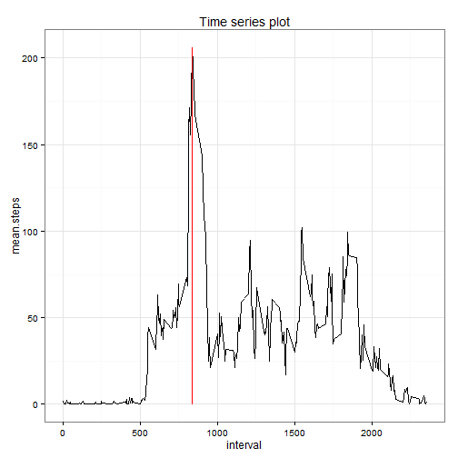

# Reproducible Research: Peer Assessment 1


## Loading and preprocessing the data

Load packages:

```r
library(ggplot2) 
```

```
## Warning: package 'ggplot2' was built under R version 3.0.3
```

Read in the data:

```r
activity<-read.csv("C:/Users/Martin/Documents/GitHub/RepData_PeerAssessment1/activity/activity.csv") 
```

Remove NAs:

```r
activity.no_na<-activity[!is.na(activity$steps),]
```

Aggregate data to mean per day and rename columns:

```r
activity.mean<-aggregate(activity.no_na$steps, by = list(activity.no_na$date), FUN = mean)
colnames(activity.mean)=c("date","mean.steps")
```

Remove NAs, aggregate data to mean per day and rename columns:

```r
activity.sum<-aggregate(activity.no_na$steps, by = list(activity.no_na$date), FUN = sum)
colnames(activity.sum)=c("date","total.steps")
```

## What is mean total number of steps taken per day?
Plot a histogram:

```r
ggplot(aes(total.steps), data=activity.sum)+
  geom_histogram(binwidth = max(activity.sum$total.steps)/30)+
  ggtitle("Histogram of the total number of steps taken each day")+
  theme_bw()
```

 

Mean total steps per day:

```r
mean(activity.sum$total.steps)
```

```
## [1] 10766
```

Median total steps per day:

```r
median(activity.sum$total.steps)
```

```
## [1] 10765
```

## What is the average daily activity pattern?
Average data:

```r
activity.average<-aggregate(activity.no_na$steps, by = list(activity.no_na$interval), FUN = mean)
colnames(activity.average)=c("interval","mean.steps")
```
Time series plot of the 5-minute interval and the average number of steps taken, averaged across all days:

```r
time.series.plot<-ggplot(aes(interval,mean.steps), data=activity.average)+
  geom_line()+
  ggtitle("Time series plot")+
  theme_bw()
print(time.series.plot)
```

 

Which 5-minute interval, on average across all the days in the dataset, contains the maximum number of steps?

```r
max.interval<-activity.average$interval[activity.average$mean.steps==max(activity.average$mean.steps)]
print(max.interval)
```

```
## [1] 835
```

Time series plot of the 5-minute interval and the average number of steps taken, averaged across all days:

```r
time.series.plot<-time.series.plot+geom_line(aes(x=max.interval),col="red")
print(time.series.plot)
```

 

## Imputing missing values
The total number of rows with NAs:

```r
nrow(activity[is.na(activity$steps),])
```

```
## [1] 2304
```

Unsophisticated strategy for filling in all of the missing values:

```r
for (t in unique(activity.average$interval)){
  activity_sub<-activity[,activity$date==t]
  activity_sub$steps[activity_sub$steps==NA]<-activity.average$steps[activity.average$interval==t]
  activity[,activity$date==t]<-activity_sub
}
```

## Are there differences in activity patterns between weekdays and weekends?
